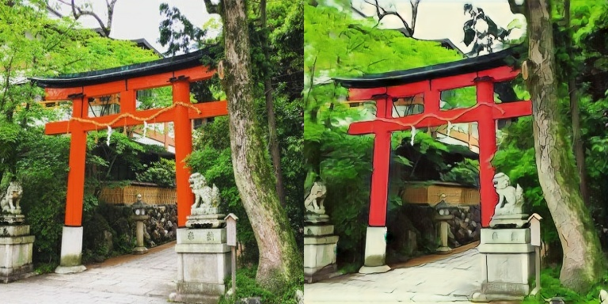
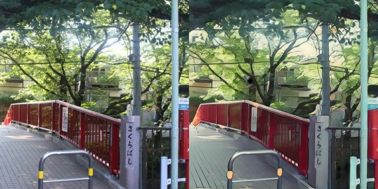
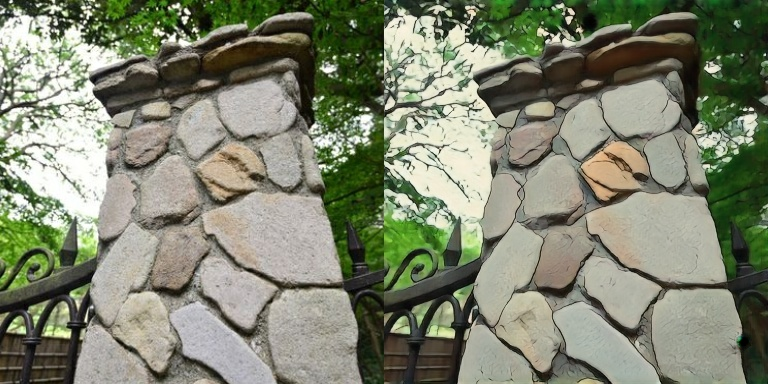
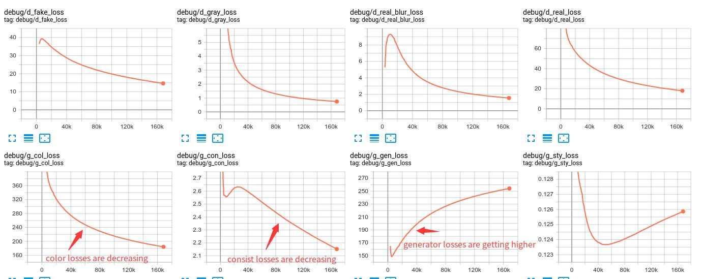

# Tensorflow 2.0 Implement of [AnimeGAN](https://github.com/TachibanaYoshino/AnimeGAN)

My implementation is summarized [here](https://zhen8838.github.io/2020/04/20/animegan/). I can't do more experiments because of the lack of more GPU. At present, only preliminary results have been achieved.

If anyone is interested, I'm glad to do research with him.

## Requirements

```sh
conda create --name tf2 python=3.7.4 -y
conda activate tf2
conda install numpy=1.17.4 tensorflow-gpu tensorflow-probability opencv tqdm toolz PyYAML -y
pip install tensorflow_addons more_itertools tensorflow_model_optimization
```

## Usage

1.  Download dataset
    
    [link](https://github.com/TachibanaYoshino/AnimeGAN/releases/tag/dataset-1)
    
2.  Modify config file

    Modify `config/default_animegan_warmup.yml` line 6 to your dataset path
    Modify `config/default_animegan.yml` line 6 to your dataset path
    
3.  Training

    ```sh
    make train_gan CFG=config/default_animegan_warmup.yml # first warmup
    make train_gan CFG=config/default_animegan.yml
    ```
4.  Tensorboard

    ```sh
    tensorboard --logdir log/default_animegan_exp_2_11 --samples_per_plugin images=0
    ```
    
5.  Inference
    you can use my [pre-trained ckpt](https://github.com/zhen8838/AnimeGAN/releases/tag/0.1).
    ```sh
    make infer_gan CKPT=log/default_animegan_exp_2_11/generator_model-50.h5 IMG=xxxxx/animedataset/test/real
    cd /tmp/test_photos/ # generate image dir
    ```

## Result







## Difference

1.  Change `anime_smooth_data` color from gray to rgb.

    ```python
    # NOTE original AnimeGAN `anime_smooth_data` is gray.
    # data_dict['anime_smooth_data'] = tf.tile(
    #     tf.image.rgb_to_grayscale(anime_smooth), [1, 1, 3])
    data_dict['anime_smooth_data'] = anime_smooth
    ```

2.  Change `style loss` color from gray to rgb.

    ```python
    # con_loss, sty_loss = self.con_sty_loss(self.p_model, real_data,
    #                                        anime_gray_data, gen_output)
    con_loss, sty_loss = self.con_sty_loss(self.p_model, real_data,
                                               anime_data, gen_output)
    ```
    
3.  Change `consist loss` model from VGG19 to MobilenetV2

    ```python
    inputs = tf.keras.Input([256, 256, 3])
    model = tf.keras.applications.MobileNetV2(
        include_top=False,
        alpha=1.3,
        weights='imagenet',
        input_tensor=inputs,
        pooling=None,
        classes=1000)
    self.p_model: tf.keras.Model = tf.keras.Model(
        inputs,
        model.get_layer('block_6_expand').output)
    # model: tf.keras.Model = tf.keras.applications.VGG19(
    #     include_top=False,
    #     weights='imagenet',
    #     input_tensor=inputs,
    #     pooling=None,
    #     classes=1000)
    # self.p_model = tf.keras.Model(
    #     inputs,
    #     tf.keras.layers.Activation('linear', dtype=tf.float32)(
    #         model.get_layer('block4_conv4').output))
    ```

## Know Issues

1.  In this implementation, my discriminator and generator did not achieve real confrontation.
   
    From the loss curve analysis, I think it is because `color loss` makes the image tend to be more reality, while `style loss` makes the image tend to be stylization, and the discriminator is too easy to distinguish, so the image be more reality.
    
    
2.  **Not every image can be animated.** 

    It seems that there is a big relationship between color and image. I haven't found the reason yet.

# Acknowledgment

Thanks very much for original [AnimeGAN](https://github.com/TachibanaYoshino/AnimeGAN) and the guidance from the original author.